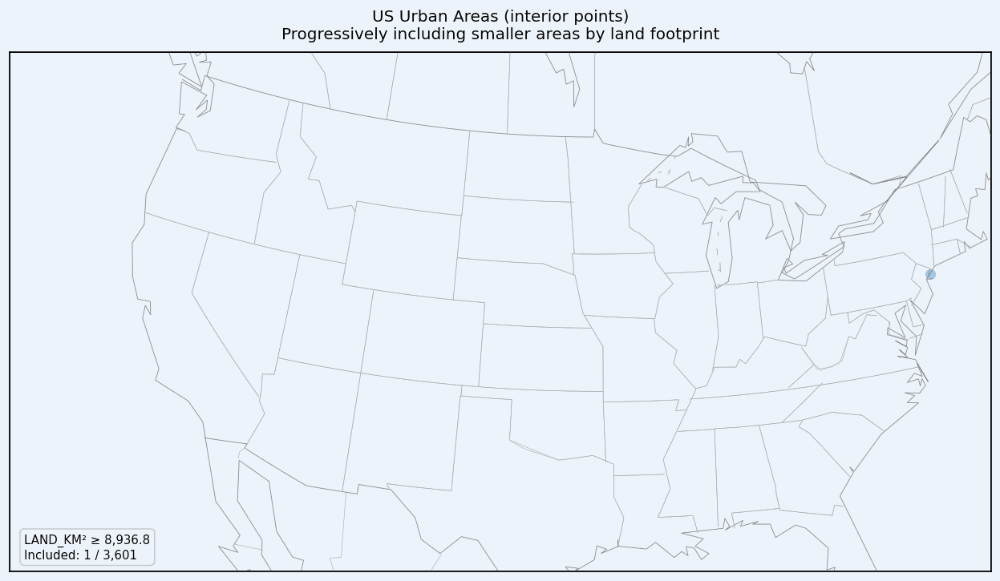
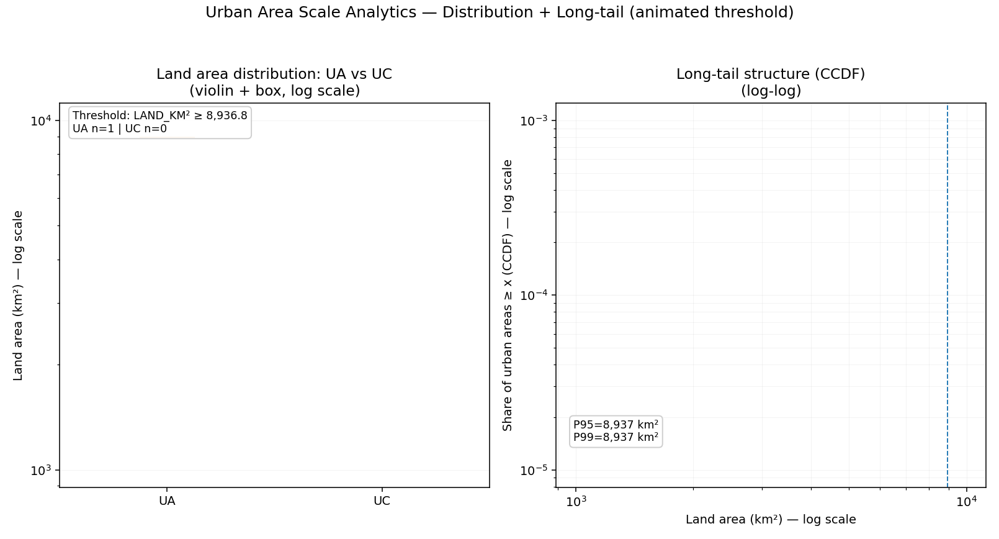

# Understanding U.S. Urban Areas  
**Spatial scale, land concentration, and urban hierarchy across the United States**

This repository presents a **dashboard-first spatial analysis** of U.S. Urbanized Areas (UAs) and Urban Clusters (UCs) using Census-defined urban geography.

The project focuses on:
- urban **scale hierarchy**
- **long-tail land distribution**
- **spatial concentration** of urban land
- structural differences between **Urbanized Areas and Urban Clusters**

The goal is not descriptive mapping, but **analytical insight into how urban land is distributed and dominated** across the U.S.

---

## Animated Analytical Insights

### 1. Spatial emergence of U.S. urban areas by scale
This animation progressively reveals urban areas from the **largest to the smallest**, showing how a relatively small number of large urban areas define the national urban footprint.

  

---

### 2. Urban land inequality and scale structure  
This animation combines two advanced distributional views:

- **Violin + boxplots (log scale)** comparing Urbanized Areas vs Urban Clusters  
- **Long-tail CCDF (log–log)** highlighting extreme concentration of urban land  

Together, these views show *why averages are misleading* and *how dominance emerges in urban systems*.

  

---

## Interactive Dashboard

The full interactive dashboard allows deeper exploration of the dataset, including:

- Filtering by **Urban Area Type (UA / UC)**
- Size-based typologies (small → mega urban areas)
- Identification of **extreme-scale outliers (top 1%)**
- Distributional comparisons using **log-scaled analytics**
- Spatial density exploration through interactive maps

  

---

## Data Source

- **United States Urban Areas Dataset**
- Census-defined Urbanized Areas and Urban Clusters
- Includes land area, water area, functional status, and interior geographic reference points

> Note: Coordinates represent **interior reference points**, not full polygon boundaries.  
> Spatial analysis emphasizes **relative distribution and scale**, not precise urban extents.

---

## Analytical Framing

This project is designed as a **professional urban analytics artifact**, emphasizing:

- scale-aware visualization
- defensible handling of skewed distributions
- explicit outlier analysis
- GIS-informed spatial interpretation

It is intentionally structured as a **dashboard-centric repository**, with the README highlighting key analytical results and the dashboard enabling interactive exploration.
